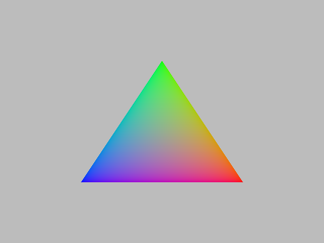

# VkInline

Trying to develop another "easy way" to program GPU using a non-C++ host language.

Previously, I did [ThrustRTC](https://github.com/fynv/ThrustRTC) and [CUDAInline](https://github.com/fynv/CUDAInline),
both of which are based on CUDA (NVRTC). 

This time, however, I'm trying to do similar things basing on Vulkan. I found it more challenging than using CUDA (NVRTC) 
because of less friendly lauguage feature of GLSL comparing to CUDA C, and more complicated host API struture. 
However, I still found it attractive to do, because:

* Vulkan is neutral to GPU vendors
* Vulkan exposes more GPU features. Computing is only a small part, there are rasterization and ray-tracing pipelines.

## Progress

### Computation

The computation part of VkInline has similar features as CUDAInline. You can easily launch a compute shader from Python, like:

```python

import VkInline as vki
import numpy as np

harr = np.array([1.0, 2.0, 3.0, 4.0, 5.0], dtype='float32')
darr = vki.device_vector_from_numpy(harr)

kernel = vki.Computer(['arr_in', 'arr_out', 'k'],
'''
void main()
{
    uint id = gl_GlobalInvocationID.x;
    if (id >= get_size(arr_in)) return;
    set_value(arr_out, id, get_value(arr_in, id)*k);
}
''')

darr_out = vki.SVVector('float', 5)
kernel.launch(1,128, [darr, darr_out, vki.SVFloat(10.0)])
print (darr_out.to_host())

```

GLSL lacks language features like "struct member functions" and "operator overloading". 
Therefore, array indexing doesn't look as nice as in CUDAInline.

Native 2,3,4 component vector types and matrix types are supported. For example
```python
v = vki.device_vector_from_list([[1, -1], [2, -3], [5, 1000]], 'double')
print (v.name_elem_type(), v.elem_size())
print(v.to_host())
```

You will get:
```
dvec2 16
[[   1.   -1.]
 [   2.   -3.]
 [   5. 1000.]]
```

### Rasterization

Rasterization is currently very much simplified in VkInline. The limiations are:

* 1 vki.Rasterizer = 1 Vulkan render-pass with 1 subpass. Multi-subpass feature of Vulkan is mostly for tiled-caching applications, which will not be implemented in VkInline.
* Currently only vertex-shader and fragment-shader programming are supported.
* Currently only a sub-set of pipeline options can be configured, during the construction of a DrawCall object. Those not covered are set to default value.
* Surfaces/Swapchains/Semaphores are not exposed. This is mainly for off-screen rendering, not quite suitable for video games. 

Example:

```python
import VkInline as vki
import numpy as np
from PIL import Image

VK_FORMAT_R8G8B8A8_SRGB = 43

width = 640
height =  480

colorBuf = vki.Texture2D(width, height, VK_FORMAT_R8G8B8A8_SRGB)

positions = np.array([ [0.0, -0.5, 0.5], [0.5, 0.5, 0.5], [-0.5, 0.5, 0.5] ], dtype = np.float32)
gpuPos = vki.device_vector_from_numpy(positions)

colors =  np.array([ [0.0, 1.0, 0.0], [1.0, 0.0, 0.0], [0.0, 0.0, 1.0]], dtype = np.float32)
gpuColors = vki.device_vector_from_numpy(colors)

rp = vki.Rasterizer(['pos', 'col'])

rp.add_draw_call(vki.DrawCall(
'''
layout (location = 0) out vec3 vColor;
void main() 
{
	gl_Position = vec4(get_value(pos, gl_VertexIndex), 1.0);
	vColor = get_value(col, gl_VertexIndex);
}
''',
'''
layout (location = 0) in vec3 vColor;
layout (location = 0) out vec4 outColor;

void main() 
{
	outColor = vec4(vColor, 1.0);
}
'''))


rp.launch([3], [colorBuf], None, [0.5, 0.5, 0.5, 1.0], 1.0, [gpuPos, gpuColors])

image_out = np.empty((height, width, 4), dtype=np.uint8)
colorBuf.download(image_out)

Image.fromarray(image_out, 'RGBA').save('output.png')

```
The code generates the following image:



### Ray-tracing

In order to enable VK_KHR_ray_tracing, Vulkan 1.2, with a bunch of additional extensions are required.
Currently, the feature is only tested with [Nvidia Beta driver](https://developer.nvidia.com/vulkan-driver).

Example:

```python
import VkInline as vki
import numpy as np
from PIL import Image
import glm

width = 800
height =  400

aabb_unit_sphere = np.array([-1.0, -1.0, -1.0, 1.0, 1.0, 1.0], dtype = np.float32)
d_aabb_unit_sphere = vki.device_vector_from_numpy(aabb_unit_sphere)
blas_unit_sphere = vki.BaseLevelAS(gpuAABB = d_aabb_unit_sphere)
transform = glm.identity(glm.mat4)
transform = glm.translate(transform, glm.vec3(0.0, 0.0, -1.0))
transform = glm.scale(transform, glm.vec3(0.5, 0.5, 0.5))
tlas = vki.TopLevelAS([[(blas_unit_sphere, transform)]])

darr_out = vki.SVVector('vec3', width*height)

raytracer = vki.RayTracer(['arr_out', 'width', 'height'], 
'''
struct Payload
{
	float t;
	vec3 color;
};

layout(location = 0) rayPayloadEXT Payload payload;

void main()
{
	int x = int(gl_LaunchIDEXT.x);
	int y = int(gl_LaunchIDEXT.y);
	if (x>=width || y>height) return;

	vec3 lower_left_corner = vec3(-2.0, -1.0, -1.0);
	vec3 horizontal = vec3(4.0, 0.0, 0.0);
	vec3 vertical = vec3(0.0, 2.0, 0.0);
	vec3 origin = vec3(0.0, 0.0, 0.0);

	float u = (float(x)+0.5)/float(width);
	float v = 1.0 - (float(y)+0.5)/float(height);

	vec3 direction = normalize(lower_left_corner + u * horizontal + v * vertical);

	uint rayFlags = gl_RayFlagsOpaqueEXT;
	uint cullMask = 0xff;
	float tmin = 0.001;
    float tmax = 1000000.0;

	traceRayEXT(arr_tlas[0], rayFlags, cullMask, 0, 0, 0, origin, tmin, direction, tmax, 0);

	set_value(arr_out, x+y*width, payload.color);
}

''', [
'''
struct Payload
{
	float t;
	vec3 color;
};

layout(location = 0) rayPayloadInEXT Payload payload;

void main()
{
	payload.t = -1.0;
	vec3 direction = gl_WorldRayDirectionEXT;
	float t = 0.5 * (direction.y + 1.0);
	payload.color = (1.0 - t)*vec3(1.0, 1.0, 1.0) + t * vec3(0.5, 0.7, 1.0);	
}
'''], [vki.HitShaders(
closest_hit = '''
struct Payload
{
	float t;
	vec3 color;
};

layout(location = 0) rayPayloadInEXT Payload payload;
hitAttributeEXT vec3 hitpoint;

void main()
{
	vec3 normal = normalize(hitpoint);
	payload.t = gl_HitTEXT;
	payload.color = (normal+vec3(1.0, 1.0, 1.0))*0.5;
}

''',
intersection = '''
hitAttributeEXT vec3 hitpoint;

void main()
{
	vec3 origin = gl_ObjectRayOriginEXT;
	vec3 direction = gl_ObjectRayDirectionEXT;
	float tMin = gl_RayTminEXT;
	float tMax = gl_RayTmaxEXT;

	const float a = dot(direction, direction);
	const float b = dot(origin, direction);
	const float c = dot(origin, origin) - 1.0;
	const float discriminant = b * b - a * c;

	if (discriminant >= 0)
	{
		const float t1 = (-b - sqrt(discriminant)) / a;
		const float t2 = (-b + sqrt(discriminant)) / a;

		if ((tMin <= t1 && t1 < tMax) || (tMin <= t2 && t2 < tMax))
		{
			float t = t1;
			if (tMin <= t1 && t1 < tMax)
			{
				hitpoint = origin + direction * t1;
			}
			else
			{
				t = t2;
				hitpoint = origin + direction * t2;
			}
			reportIntersectionEXT(t, 0);
		}
	}

}
'''
)])

svwidth = vki.SVInt32(width)
svheight = vki.SVInt32(height)

raytracer.launch((width, height), [darr_out, svwidth, svheight], [tlas])

out = darr_out.to_host()
out = out.reshape((height,width,3))*255.0
out = out.astype(np.uint8)
Image.fromarray(out, 'RGB').save('output.png')
```

The code generates the following image:


## Installation

### Install from Source Code

Source code of VkInline is available at:
https://github.com/fynv/VkInline

At build time, you will need:
* UnQLite source code, as submodule: thirdparty/unqlite
* glslang, as submodule: thirdparty/glslang
* SPIRV-Cross, as submodule: thirdparty/SPIRV-Cross 
* Vulkan-Headers, as submodule: thirdparty/Vulkan-Headers
* volk, as submodule: thirdparty/volk
* CMake 3.x

After cloning the repo from github and resolving the submodules, you can build it
with CMake.

```
$ mkdir build
$ cd build
$ cmake .. -DBUILD_PYTHON_BINDINGS=true -DVKINLINE_BUILD_TESTS=true -DVKINLINE_INCLUDE_PYTESTS=true
$ make
$ make install
```
You will get the library headers, binaries and examples in the "install" directory.

### Install PyVkInline from PyPi

Builds for Win64/Linux64 + Python 3.x are available from Pypi. If your
environment matches, you can try:

```
$ pip3 install VkInline
```

## Runtime Dependencies

A Vulkan-capable GPU and a recent driver is needed at run-time.

You may also need Vulkan SDK at runtime for some platforms.

At Python side, VkInline depends on:
* Python 3
* cffi
* numpy
* pyglm

## License 

I've decided to license this project under ['"Anti 996" License'](https://github.com/996icu/996.ICU/blob/master/LICENSE)

Basically, you can use the code any way you like unless you are working for a 996 company.

[](https://996.icu)


